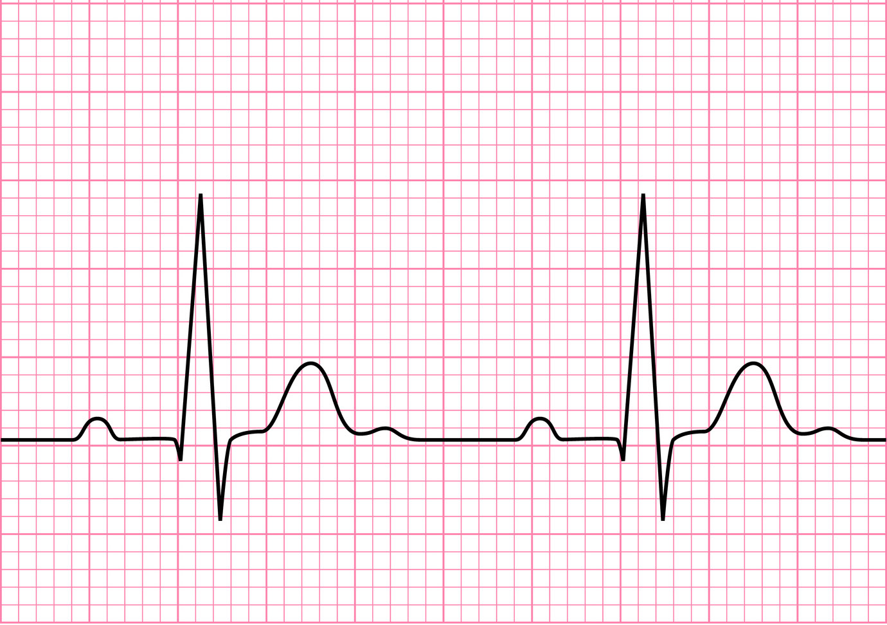

# ECG-Heartbeat-Classification

Electrocardiography is the process of producing an electrocardiogram (ECG or EKG), a recording – a graph of voltage versus time – of the electrical activity of the heart using electrodes placed on the skin. ECG is a very important and significant tool in heart disease diagnoses.

Changes in the normal ECG pattern occur in numerous cardiac abnormalities, including cardiac rhythm disturbances (such as atrial fibrillation and ventricular tachycardia), inadequate coronary artery blood flow (such as myocardial ischemia and myocardial infarction), and electrolyte disturbances (such as hypokalemia and hyperkalemia).

In this project, I want to classify different arrhytmia types on ECG using Neural Networks. 
The [MIT-BIH Arrhythmia Database](https://physionet.org/content/mitdb/1.0.0/) contains 48 half-hour excerpts of two-channel ambulatory ECG recordings, obtained from 47 subjects studied by the BIH Arrhythmia Laboratory between 1975 and 1979. Twenty-three recordings were chosen at random from a set of 4000 24-hour ambulatory ECG recordings collected from a mixed population of inpatients (about 60%) and outpatients (about 40%) at Boston's Beth Israel Hospital; the remaining 25 recordings were selected from the same set to include less common but clinically significant arrhythmias that would not be well-represented in a small random sample.

Arrhythmia Dataset

    Number of Samples: 109446
    Number of Categories: 5
    Sampling Frequency: 125Hz
    Data Source: Physionet's MIT-BIH Arrhythmia Dataset
    Classes: ['N': 0, 'S': 1, 'V': 2, 'F': 3, 'Q': 4]

- N : Non-ecotic beats (normal beat)
- S : Supraventricular ectopic beats
- V : Ventricular ectopic beats
- F : Fusion Beats
- Q : Unknown Beats

*Remark: These signals are preprocessed and segmented, with each segment corresponding to a heartbeat. All the samples are cropped, downsampled and padded with zeroes if necessary to the fixed dimension of 188.*
